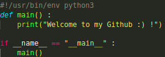
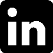

### Hey, I'm thibaut :)

<h3> •💻 About Me </h3>

- 🤔 &nbsp; Exploring new technologies, and developing.

- 🎓 &nbsp; Studying at Epitech Montpellier, currently in first year.

- 🌱 &nbsp; Learning about C, C++ & Python programming language, and algorithms.

- ✍️ &nbsp; Pursuing Developement, I want to try new things to see what interests me the most.

<h3>🛠 Tech Stack</h3>

- 💻 &nbsp; C | Python | Java

- 🌐 &nbsp; Vue.js | CSS | HTML | Nuxt3

- 🔧 &nbsp; Git | Markdown

- 🖥 &nbsp; Word | PowerPoint | VsCode

<!--

- 🛢 &nbsp; MySQL### Hey, I'm Alan ;)

<h3> 👨🏻•💻 About Me </h3>

- 🤔 &nbsp; Exploring new technologies, and developing.

- 🎓 &nbsp; Studying at Epitech Montpellier, currently in first year.

- 🌱 &nbsp; Learning about Rust programming language, and algorithms.

- ✍️ &nbsp; Pursuing Developement, I want to try new things to see what interests me the most.

<h3>🛠 Tech Stack</h3>

- 💻 &nbsp; C | Python

- 🌐 &nbsp; HTML | CSS | Vue.js

<!--

- 🛢 &nbsp; MySQL

- 🔧 &nbsp; Git | Markdown

- 🖥 &nbsp; Word | Excel | PowerPoint | Photoshop

-->

<h3>🛠 To Learn</h3>

- 🔧 &nbsp; C | C++ | Python | Ruby | Rust

<h3> 🤝🏻 Contact Me </h3>

 

" "

